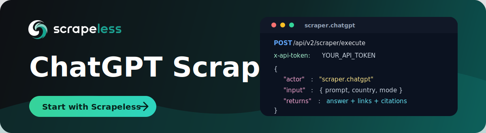

# ChatGPT Scraper

<p align="center">
  <a href="https://app.scrapeless.com/passport/login?redirect=/quick-start&utm_source=github&utm_medium=repo&utm_campaign=chatgpt_scraper" target="_blank">
    
  </a>
</p>

<p align="center">
  <a href="https://app.scrapeless.com/passport/login?redirect=/quick-start&utm_source=github&utm_medium=repo&utm_campaign=chatgpt_scraper">
    
  </a>
  <a href="https://www.scrapeless.com/en/blog?utm_source=github&utm_medium=repo&utm_campaign=chatgpt_scraper">
    
  </a>
  <a href="https://x.com/Scrapelessteam">
    
  </a>
  <a href="https://www.linkedin.com/company/scrapeless/">
    
  </a>
</p>

Collect ChatGPT answers through the **Scrapeless LLM Chat Scraper** API, including Markdown responses, search links, source references, shopping products, and ads, without reverse-engineering the ChatGPT UI, maintaining browsers, or building your own anti-blocking stack.

Use this repo when you need a repeatable way to monitor ChatGPT answers for GEO and AI search visibility, compare prompts across regions, audit cited sources, track shopping recommendations, or pipe AI responses into analytics and automation workflows.

- **Full documentation:** https://docs.scrapeless.com/en/llm-chat-scraper/quickstart/introduction/
- **Get your `x-api-token`:** https://app.scrapeless.com/passport/login?redirect=/quick-start
- **API endpoint:** `POST https://api.scrapeless.com/api/v2/scraper/execute`

## How it works

Send a single `POST` request to the Scrapeless endpoint with your API token in
the `x-api-token` header. The body specifies the actor (`scraper.chatgpt`) and
an `input` object with your prompt and options. The API runs the query and
returns the structured result in `task_result`.

```http
POST https://api.scrapeless.com/api/v2/scraper/execute
Content-Type: application/json
x-api-token: <YOUR_API_TOKEN>
```

## Quick start (curl)

```bash
curl 'https://api.scrapeless.com/api/v2/scraper/execute' \
  --header 'Content-Type: application/json' \
  --header 'x-api-token: YOUR_API_TOKEN' \
  --data '{
    "actor": "scraper.chatgpt",
    "input": {
      "prompt": "Most reliable proxy service for data extraction",
      "country": "US",
      "web_search": true,
      "shopping": false
    }
  }'
```

To receive the result asynchronously, add a `webhook` object:

```json
"webhook": { "url": "https://www.your-webhook.com" }
```

## Request parameters

The request body has three top-level fields: `actor` (always `scraper.chatgpt`),
`input` (below), and an optional `webhook`.

| Parameter (`input.*`) | Type    | Required | Description                                                                                       |
| --------------------- | ------- | -------- | ------------------------------------------------------------------------------------------------- |
| `prompt`              | string  | Yes      | Prompt to send to ChatGPT.                                                                        |
| `country`             | string  | Yes      | Country / region code (e.g. `US`, `JP`).                                                          |
| `web_search`          | boolean | No       | Enable web search enrichment.                                                                     |
| `shopping`            | boolean | No       | Fetch shopping data. Defaults to `true`. When enabled, product info is returned in `products`.    |

> **Billing note:** When the response includes shopping data (the `products`
> field), the call is charged at **2× the base rate** due to the extra work of
> extracting product information from multiple sources.

## Response

A successful call returns a status envelope; the scraped data lives in
`task_result`:

```json
{
  "status": "success",
  "task_id": "e705743d-da2e-4163-9ccd-eef62529ff72",
  "task_result": {
    "prompt": "Most reliable proxy service for data extraction",
    "result_text": "...markdown answer...",
    "model": "gpt-5-1",
    "web_search": true,
    "links": [],
    "search_result": [
      { "attribution": "example.com", "title": "...", "snippet": "...", "url": "https://..." }
    ],
    "content_references": [],
    "products": [],
    "ads": {},
    "map": {}
  }
}
```

### Top-level fields

| Field         | Type   | Description                                    |
| ------------- | ------ | ---------------------------------------------- |
| `status`      | string | Request status, e.g. `success`.                |
| `task_id`     | string | Unique identifier for the task.                |
| `task_result` | object | Scraped result (fields below).                 |

### `task_result` fields

| Field                | Type   | Description                                                  |
|----------------------| ------ |--------------------------------------------------------------|
| `prompt`             | string | Original prompt.                                             |
| `result_text`        | string | Markdown response from ChatGPT.                              |
| `model`              | string | Model identifier, e.g. `gpt-5-1`.                            |
| `web_search`         | bool   | Whether search enrichment ran.                               |
| `links`              | array  | Supplementary links.                                         |
| `search_result`      | array  | SERP results (`attribution`, `snippet`, `title`, `url`).     |
| `content_references` | array  | References inside the answer (`attribution`, `title`, `url`). |
| `products`           | array  | Product information (present when `shopping` is enabled).    |
| `ads`                | object | Ads information returned by ChatGPT.                         |
| `map`                | object | Map information returned by ChatGPT.                         |

For the complete field list (product offers, ratings, ad cards, carousels,
etc.), see the [official documentation](https://docs.scrapeless.com/en/llm-chat-scraper/quickstart/introduction/).

## Code examples

Ready-to-run examples live in [`examples/`](./examples):

| Language | File                                       | Run                                   |
| -------- | ------------------------------------------ | ------------------------------------- |
| Python   | [`example.py`](./examples/example.py)      | `pip install requests && python example.py` |
| Node.js  | [`example.js`](./examples/example.js)      | `node example.js` (Node 18+)          |
| Go       | [`example.go`](./examples/example.go)      | `go run example.go`                   |
| Java     | [`Example.java`](./examples/Example.java)  | `java Example.java` (Java 11+)        |
| PHP      | [`example.php`](./examples/example.php)    | `php example.php`                     |

All examples read the token from the `SCRAPELESS_API_TOKEN` environment variable:

```bash
export SCRAPELESS_API_TOKEN="your_api_token"
```

## Practical use cases

### AI answer monitoring

Track how ChatGPT responds to your brand, product category, documentation topics, or competitor prompts. Store the Markdown answer, search results, and references so your team can measure AI visibility over time.

### GEO and SEO research

Run the same prompt across countries to compare which sources ChatGPT cites, how recommendations change by region, and where your content appears in AI-generated answers.

### Competitor intelligence

Collect structured ChatGPT answers for competitor names, feature comparisons, pricing questions, and "best tool for..." prompts. Use the output to identify messaging gaps and content opportunities.

### Dataset and workflow automation

Pipe ChatGPT answers into internal dashboards, knowledge-base QA systems, spreadsheets, data warehouses, or alerting workflows through the synchronous API response or webhook callback.

## Why use Scrapeless for ChatGPT scraping?

| Benefit | What it means for your team |
| ------- | --------------------------- |
| One unified API | Query ChatGPT through the same Scrapeless LLM Chat Scraper workflow used for other AI answer engines. |
| Structured output | Receive Markdown answers, search results, references, products, ads, and prompts in a developer-friendly response. |
| Less maintenance | Avoid building browser automation, UI selectors, proxy rotation, retries, and anti-blocking logic yourself. |
| Region-aware analysis | Use country inputs to compare localized AI answers and source citations. |
| Production integration | Use API tokens, webhooks, and language examples to connect ChatGPT data to real applications quickly. |

## FAQ

### What is ChatGPT Scraper?

ChatGPT Scraper is a Scrapeless LLM Chat Scraper actor that sends prompts to ChatGPT and returns structured answer data, including the Markdown response, search results, content references, shopping products, ads, and map data.

### Do I need to run a browser or proxy pool?

No. This repo shows how to call the Scrapeless API. Scrapeless handles the scraping workflow behind the API, so your application only needs to send requests and process the returned data.

### What do `web_search` and `shopping` do, and how are they billed?

`web_search` enables web search enrichment so the answer includes SERP-style `search_result` data. `shopping` fetches product information into the `products` field. When the response includes shopping data, the call is charged at **2× the base rate** due to the extra work of extracting product information from multiple sources.

### Can I get results asynchronously?

Yes. Add a `webhook` object with your callback URL to receive results asynchronously when the task completes.

### Is this suitable for AI search visibility monitoring?

Yes. The response includes AI-generated Markdown, search results, outbound links, and content references, which makes it useful for GEO analysis, brand monitoring, source tracking, and competitive research.

### What should I consider before using AI scraping in production?

Make sure your use case complies with applicable laws, platform terms, privacy requirements, and your organization's data policies. Avoid collecting sensitive, private, or unauthorized information.

## Learn more

- [Scrapeless LLM Chat Scraper documentation](https://docs.scrapeless.com/en/llm-chat-scraper/quickstart/introduction/)
- [Supported LLM Chat Scraper actors](https://docs.scrapeless.com/en/llm-chat-scraper/quickstart/introduction/)
- [Scrapeless dashboard](https://app.scrapeless.com/passport/login?redirect=/quick-start)
- [Scrapeless website](https://www.scrapeless.com/en)

## Contact us

Need help building a ChatGPT monitoring workflow or scaling AI answer collection?

- Join our [Discord](https://discord.gg/VU2vtbq7Q2).
- Contact us on [Telegram](https://t.me/scrapeless).
- For repo-specific issues or improvements, open an issue or pull request in this repository.
